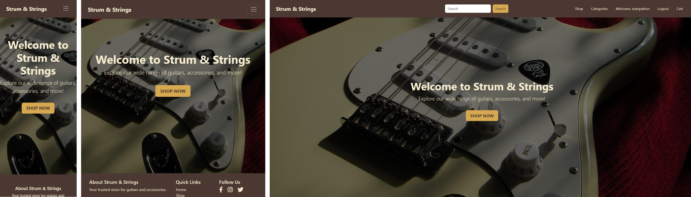
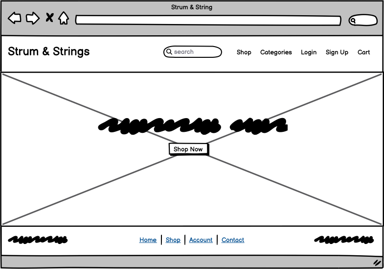
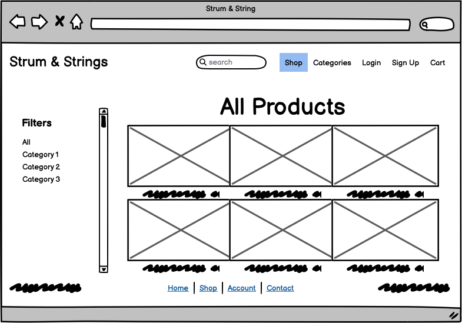
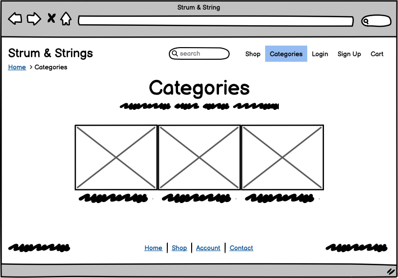
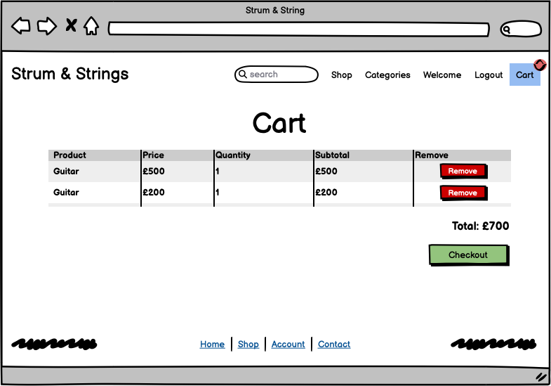
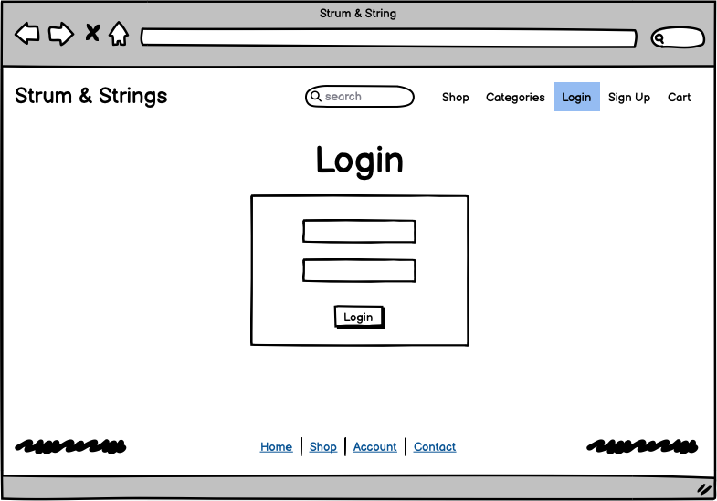
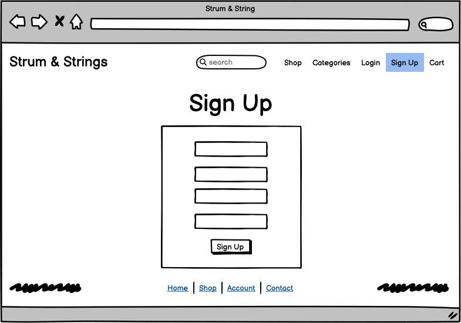
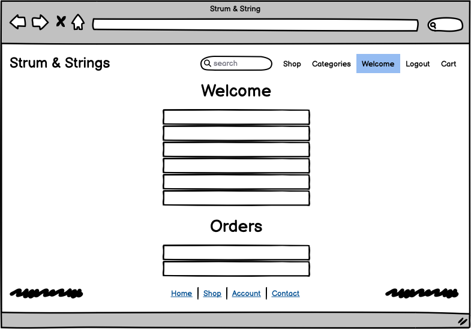
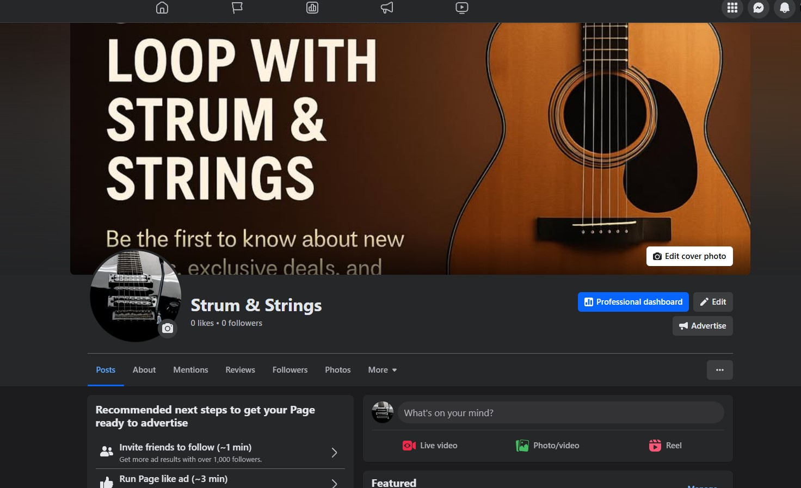

# Strum & Strings

Welcome to **Strum & Strings** – Your Ultimate Guitar Destination

Strum & Strings is a full-stack Django-based e-commerce platform built to deliver a seamless online shopping experience for guitar enthusiasts.  
Customers can explore a curated range of premium guitars and accessories, add items to their basket, and complete secure purchases through Stripe integration.

With a responsive, intuitive, and mobile-first design, Strum & Strings ensures a smooth and enjoyable shopping experience on all devices.  
From product discovery to checkout, the site offers a clean, elegant interface that reflects the passion of true guitar lovers.

Your perfect sound is just a few clicks away!

Visit the live website [here](https://strum-and-strings-e5017bc28566.herokuapp.com/)

---

## Table of Contents

1. [User Experience (UX)](#user-experience-ux)  
    1. [Project Goals](#project-goals)  
    2. [Implementation](#implementation)  
    3. [Color Scheme](#color-scheme)  
    4. [Typography](#typography)  
    5. [Database Model](#database-model)  
    6. [Wireframes](#wireframes)  
2. [Features](#features)  
    1. [Home Page](#home-page)  
    2. [About Us](#about-us)  
    3. [Product Listings](#product-listings)  
    4. [Product Details](#product-details)  
    5. [Cart and Checkout](#cart-and-checkout)  
    6. [Profile Management](#profile-management)  
    7. [Newsletter Signup](#newsletter-signup)  
    8. [Admin Panel](#admin-panel)  
3. [Technologies Used](#technologies-used)  
4. [Testing](#testing)  
5. [Finished Product](#finished-product)  
6. [Deployment](#deployment)  
7. [Marketing Strategies](#marketing-strategies)  
8. [Credits](#credits)  
9. [Acknowledgements](#acknowledgements)

# Business Model

## Business Overview

**Strum & Strings** is an e-commerce platform specializing in the sale of guitars and related accessories. The site caters to a diverse audience, including individual musicians, hobbyists, students, and educational institutions.

---

## Target Audience

- **Musicians**: Hobbyists, professionals, and performers looking for high-quality guitars and accessories.
- **Students**: Aspiring musicians and beginners seeking affordable starter kits or beginner-friendly bundles.
- **Educational Institutions**: Schools, colleges, and universities needing bulk orders or tailored packages for music programs.

---

## Product Offering

- **Individual Products**:
  - Guitars: Acoustic, electric, bass, classical, and specialty guitars.
  - Accessories: Strings, picks, amplifiers, tuners, straps, cases, and cleaning kits.

- **Bundles**:
  - **Starter Kits**: Beginner packages that include a guitar, strap, tuner, and spare strings.
  - **Advanced Kits**: Professional bundles featuring a high-end guitar, amplifier, and essential accessories.
  - **Institutional Packages**: Customized bulk packages designed for educational settings.

---

## Revenue Model

- **Product Sales**:  
  Competitive pricing on individual items and bundled deals.

- **Upselling & Cross-Selling**:  
  Complementary items (e.g., picks, straps, tuners) suggested at checkout to increase average order value.

- **Institutional Discounts**:  
  Special pricing for schools and colleges ordering in bulk.

- **Subscription Add-On (Planned)**:  
  A future premium subscription offering exclusive content like tutorials, maintenance guides, and early access to new products.

---

## Unique Selling Points

- **Specialization**:  
  Focused exclusively on guitars and accessories to ensure curated quality.

- **Customization**:  
  Tailored bundles for individuals, students, and institutions.

- **Educational Focus**:  
  Potential collaborations with music educators and institutions to support music learning.

- **Convenience**:  
  A clean, intuitive online shopping experience optimized for all devices.

---

## Marketing Strategies

- **Digital Advertising**:  
  Targeted ad campaigns on Facebook, Instagram, and Google to reach niche audiences.

- **Social Media Engagement**:  
  Regular posts including tips, tutorials, and customer stories to build community.

- **Email Campaigns**:  
  Newsletters featuring promotions, product launches, and helpful guitar content.

- **Affiliate Partnerships**:  
  Collaborations with music influencers, educators, and content creators to expand reach and credibility.

# User Experience (UX)

## Project Goals

- Deliver a clean, responsive online store focused on guitars and accessories.
- Allow users to browse, search, and filter products with ease.
- Enable secure checkout through a seamless shopping cart system.
- Provide a user-friendly profile area to manage personal details and track orders.
- Offer newsletter signup for product updates, promotions, and brand engagement.
- Ensure full mobile responsiveness and fast performance on all device types.
- Build user trust through professional design, clear CTAs, and intuitive navigation.

---

## Implementation

- Built with the **Django** framework using structured models for products, orders, and user profiles.
- **Bootstrap 5** ensures responsive, mobile-first layouts across desktop, tablet, and mobile.
- **Cloudinary** handles external image hosting for faster load times and reliable media delivery.
- **Stripe** is integrated to provide secure, real-time payment processing.
- **Django-Allauth** powers user authentication, enabling secure signup, login, and profile access.
- **Mailchimp** integration enables newsletter signup and future email marketing campaigns.

---

## Color Scheme

The color palette is inspired by natural and wooden tones to reflect the aesthetic of traditional and modern guitars:

- **Primary**: Deep brown `#4B3621` — used for the navbar, headers, and footer.
- **Accent**: Soft tan `#D4A373` — used for buttons, highlights, and subtle accents.
- **Background**: Warm off-white `#FAF7F2` — creates a neutral canvas for content.
- **Forms**: Clean white backgrounds to ensure contrast and accessibility.

---

## Typography

- **Font Family**: Open Sans with Arial as a sans-serif fallback.
- **Headings**: Bold Open Sans for emphasis and readability.
- **Body Text**: Clean, modern sans-serif font optimized for readability on all screen sizes.

---

## Database Models

The site uses **PostgreSQL** as the production database. Below are the core Django models used to manage application data:

- **Product**: Stores details such as name, brand (FK), category (FK), model, image, Cloudinary URL, description, and price.
- **Category**: Represents product categories (e.g., Acoustic, Electric, Bass).
- **Order**: Stores customer orders, including status tracking and associated order items.
- **CartItem**: Represents individual items in a user's temporary shopping cart.
- **UserProfile**: Extends the default user model with additional fields such as address, city, country, and postal code.
- **NewsletterSubscriber**: Captures email subscriptions and optionally links to a registered user; integrates with Mailchimp.

---

## Wireframes

Wireframes were created using **Balsamiq** to map out the site structure and user interface across desktop and mobile views.

### Planned Wireframes:

- **Home Page**: Features a hero section and quick access to product categories.
- **Shop Page**: Displays product listings with integrated search and filtering options.
- **Product Detail Page**: Showcases product images, details, and an add-to-cart function.
- **Cart & Checkout Pages**: Provide a clean, step-by-step flow from cart review to Stripe payment.
- **Profile & Order History Page**: Allows users to manage their personal information and view past orders.

---

### Wireframe Images

- **Home Page**

  

- **Shop Page**

  

- **Categories Page**

  

- **Cart Page**

  

- **Login Page**

  

- **Signup Page**

  

- **Profile Page**

  

---

### Wireframe Evolution

These wireframes served as the foundational layout for key user flows during the planning phase.  
As development progressed, several enhancements were made to elevate the user experience and reflect the brand identity of **Strum & Strings**.

#### Key Improvements:
- Enhanced styling using **Bootstrap 5** components for consistency and accessibility.
- Improved spacing, font usage, and responsive behavior across all screen sizes.
- Refined product detail layout to better highlight visuals and pricing.
- Streamlined checkout process for faster user completion and improved flow.
- The admin dashboard includes front-end CRUD functionality, allowing admins to edit products, view and manage orders, and access newsletter subscriber information.

While the final implementation stays true to the core wireframe structure, adjustments were made to deliver a more polished, professional, and user-centric interface.

---

# Features

## Home Page

- Features a clean hero banner introducing the brand and its mission.
- Includes a responsive navigation menu with links to Shop, Profile, Cart, and Newsletter Signup.

## Shop Page

- Displays all available guitars and accessories in a responsive grid layout.
- Users can filter products by category (e.g., Acoustic, Electric, Bass).
- Includes real-time search functionality to help users quickly find products.

## Categories Page

- Showcases the two primary guitar categories along with accessories, enabling intuitive browsing by product type.
- Category filtering and search functionality mirror those of the main shop page for consistency.

## Product Detail Page

- Provides detailed information for each product, including:
  - Name, brand, model, price, and full description.
  - High-quality product images served via **Cloudinary**.
- Includes an "Add to Cart" button with a quantity selector.
- Displays a section of related products to encourage further browsing.

## Cart and Checkout

- **Cart Page**:
  - Users can view all items added to their cart.
  - Options to edit quantities or remove products.
  - Displays dynamic total cost including delivery fees.

- **Checkout Page**:
  - Users securely complete purchases via **Stripe Checkout**.
  - Delivery information form with real-time validation.
  - Redirect to a confirmation page upon successful payment, displaying full order details.

## Profile and Order History

- Logged-in users can access their profile dashboard.
- Features include:
  - Viewing and managing personal details.
  - Accessing full order history with individual order summaries.

## Newsletter Signup

- Users can subscribe to a newsletter for updates, offers, and product announcements.
- Frontend form validates email input and prevents duplicate signups.
- Confirmation message shown upon successful submission and redirect to Mailchimp.

## Admin Panel

- Custom Django Admin interface for efficient backend management:
  - Products, categories, orders, and newsletter subscribers can be added, edited, or deleted.
  - Orders are viewable with detailed customer and product info.
  - Cloudinary image URLs can be edited directly within product admin forms.
- Admin dashboard includes frontend CRUD functionality to:
  - Manage products via a custom catalog interface.
  - View and update order status.
  - Access a list of newsletter subscribers.

---

# Technologies Used

## Languages

- [HTML5](https://en.wikipedia.org/wiki/HTML5) – Used to structure the website content.
- [CSS3](https://en.wikipedia.org/wiki/Cascading_Style_Sheets) – Provides layout, visual styling, and responsiveness.
- [JavaScript](https://en.wikipedia.org/wiki/JavaScript) – Powers interactive elements and dynamic front-end behaviors.
- [Python 3](https://www.python.org/) – Used for server-side logic and Django application development.
- [SQL (PostgreSQL)](https://www.postgresql.org/) – Relational database used in production via Heroku.

---

## Frameworks and Platforms

- [Django](https://www.djangoproject.com/) – Full-stack Python web framework used for backend architecture and database management.
- [Bootstrap 5](https://getbootstrap.com/) – Frontend framework used for responsive, mobile-first design.
- [Django-Allauth](https://django-allauth.readthedocs.io/en/latest/) – Handles user registration, login, and account management.
- [Gunicorn](https://gunicorn.org/) – WSGI server used for deploying Django apps to Heroku.

---

## Libraries and Tools

- [Stripe](https://stripe.com/) – Enables secure online payments through hosted checkout and webhook integration.
- [Cloudinary](https://cloudinary.com/) – Handles media storage and delivery of product images.
- [Mailchimp](https://mailchimp.com/) – Integrated for newsletter subscription and email marketing.
- [Balsamiq](https://balsamiq.com/) – Used to create low-fidelity wireframes during the design phase.
- [Git](https://git-scm.com/) – Version control system used throughout the development process.
- [GitHub](https://github.com/) – Hosts the codebase and manages collaboration and version history.
- [Heroku](https://www.heroku.com/) – Platform-as-a-service used for live deployment of the project.
- [Crispy Forms (Bootstrap 5)](https://django-crispy-forms.readthedocs.io/en/latest/) – Enhances Django form presentation using Bootstrap 5 styling.
- [Whitenoise](http://whitenoise.evans.io/en/stable/) – Serves static files efficiently in production on Heroku.

---

## Development Tools

- [Visual Studio Code](https://code.visualstudio.com/) – Primary code editor with extensions for Python and Django.
- [Chrome DevTools](https://developer.chrome.com/docs/devtools/) – Used to inspect elements, debug JavaScript, and test responsive behavior.
- [W3C Markup Validator](https://validator.w3.org/) – Ensures HTML5 compliance.
- [W3C CSS Validator](https://jigsaw.w3.org/css-validator/) – Validates CSS for syntax and accessibility.
- [JSHint](https://jshint.com/) – Identifies potential issues in JavaScript code.
- [CI Python Linter](https://pep8ci.herokuapp.com/) – Checks Python code against PEP8 standards.

---

# Testing

## Validator Testing

- **HTML**:  
  - All HTML pages were tested using the [W3C Markup Validator](https://validator.w3.org/).
  - Minor warnings were addressed (such as empty `alt` attributes where needed for accessibility).
- **CSS**:  
  - The CSS was tested using the [W3C CSS Validator](https://jigsaw.w3.org/css-validator/).
  - No critical errors detected.
- **Python**:  
  - Code was tested with the [CI Python Linter](https://pep8ci.herokuapp.com/).
  - All Python scripts pass with no major PEP8 style issues.
- **JavaScript**:  
  - Custom scripts were tested using [JSHint](https://jshint.com/).
  - No major warnings or errors reported.

---

## Testing Strategy

This section outlines the comprehensive testing approach used for the Strum & Strings e-commerce site. The goal was to ensure all core functionality works as expected across multiple scenarios and devices. Testing includes:

- **Manual Testing**: Performed throughout the development process to verify user flows, business logic, and design responsiveness.
- **Form Validation Testing**: Ensures all forms handle valid and invalid input correctly, including field-level and model-level validation.
- **Authentication Testing**: Covers registration, login/logout, and profile management.
- **Checkout & Payment Testing**: Simulates full order flow using Stripe in test mode.
- **Admin Panel Testing**: Verifies functionality for managing products, orders, and users.
- **Error Handling**: Confirms that friendly 404 pages and validation errors are properly handled.
- **Browser & Device Compatibility Testing**: Ensures the app is usable and responsive on major browsers and screen sizes.

Each testing section below contains specific cases and results.

### Manual Testing Summary

The table below outlines key user flows and whether they performed as expected during testing.

| Category        | Feature                                 | Expected Outcome                                                                | Result |
|-----------------|-----------------------------------------|---------------------------------------------------------------------------------|--------|
| User            | Homepage loads                          | Homepage displays shop now button and background image                          | Pass   |
| User            | User Registration                       | New user can register with valid info and is redirected confirmation page       | Pass   |
| User            | Login/Logout                            | Users can log in and log out successfully                                       | Pass   |
| User            | Profile View                            | Logged-in users can view their details and past orders                          | Pass   |
| User            | Profile Edit                            | Users can update basic details like name and email                              | Pass   |
| User            | Product Listing                         | Products display with image, title, price, and sorting/filtering works          | Pass   |
| User            | Product Detail View                     | Clicking a product shows full detail with image, price, and add-to-cart button  | Pass   |
| User            | Add to Cart                             | Cart updates and displays product, quantity, and total correctly                | Pass   |
| User            | Update Cart Quantity                    | User can adjust quantity in cart and total updates accordingly                  | Pass   |
| User            | Remove from Cart                        | Items can be removed from cart                                                  | Pass   |
| User            | Checkout Process                        | Stripe checkout redirects, payment completes, order is saved                    | Pass   |
| User            | Order Confirmation                      | Confirmation page displays summary after payment                                | Pass   |
| User            | Newsletter Signup                       | Email is submitted, and confirmation message is shown                           | Pass   |
| Admin           | Admin Login                             | Admins can access the Django admin panel using correct credentials              | Pass   |
| Admin           | Access Django Admin Panel               | Full admin panel is visible with models for products, orders, users, etc.       | Pass   |
| Admin           | Manage Products                         | Admins can add, edit, or delete products from both the admin and custom panel   | Pass   |
| Admin           | View Order List                         | Admin dashboard lists all orders with product, quantity, and status             | Pass   |
| Admin           | Edit Order Info                         | Admin can update user details and status of individual orders                   | Pass   |
| Admin           | Manage Newsletter Subscribers           | Admin can view and manage newsletter email signups in the admin panel           | Pass   |
| System/UX       | Responsive Design                       | Site is fully responsive on mobile, tablet, and desktop                         | Pass   |
| System/UX       | 404 Error Page                          | Invalid URL shows friendly custom 404 page                                      | Pass   |
| System/UX       | SEO Tags                                | Meta descriptions and titles set for all pages                                  | Pass   |
| System/UX       | Site Loads on All Major Browsers        | Tested successfully on Chrome, Firefox, Safari, Edge                            | Pass   |

### Responsive Design Testing

Responsiveness was tested across all major pages and screen sizes to ensure a consistent and accessible user experience.

| Device Type | Screen Size (px) | Tested Pages     | Expected Behavior                                               | Result |
|-------------|------------------|------------------|-----------------------------------------------------------------|--------|
| Mobile      | 375×667          | All key pages    | Elements stack vertically, navigation collapses, forms readable | Pass   |
| Tablet      | 768×1024         | All key pages    | Grid layout maintained, cards and inputs scale correctly        | Pass   |
| Desktop     | 1440×900+        | All key pages    | Full layout displays, navigation, carousels and tables align    | Pass   |

### User Registration

| Feature Tested       | Expected Outcome                                          | Actual Result  | Notes                        |
|----------------------|-----------------------------------------------------------|----------------|------------------------------|
| Registration Page    | Registration page loads correctly                         | Pass           |                              |
| Form Submission      | User can register with valid data                         | Pass           |                              |
| Redirect             | User is redirected to email confirmation page             | Pass           |                              |
| Email Confirmation   | Confirmation email is received                            | Pass           |                              |
| Account Activation   | Clicking the confirmation link activates the account      | Pass           | Tested with test email inbox |

### Login Functionality

| Feature Tested         | Expected Outcome                             | Actual Result | Notes |
|------------------------|----------------------------------------------|----------------|-------|
| Login Page             | Login form is displayed                      | Pass           |       |
| Form Submission        | User is logged in with valid credentials     | Pass           |       |
| Redirect After Login   | User is redirected to homepage               | Pass           |       |

### Logout Functionality

| Feature Tested          | Expected Outcome                                              | Actual Result  | Notes |
|-------------------------|---------------------------------------------------------------|----------------|-------|
| Logout Action           | User is logged out and redirected to homepage                 | Pass           |       |
| Access to Protected Page| User cannot view previous pages open to logged in users       | Pass           |       |

### View Product Catalog

| Feature Tested         | Expected Outcome                                                        | Actual Result  | Notes |
|------------------------|-------------------------------------------------------------------------|----------------|-------|
| Shop Button            | Redirects user to All Products page                                     | Pass           |       |
| Product Listings       | All products are displayed and accessible                               | Pass           |       |
| View Details Button    | Clicking shows full product details on a dedicated product page         | Pass           |       |

### Profile View

| Feature Tested     | Expected Outcome                                                      | Actual Result  | Notes                                       |
|--------------------|-----------------------------------------------------------------------|----------------|---------------------------------------------|
| Access Profile Page| Logged-in user can access the profile page                            | Pass           |                                             |
| View Info          | User sees basic info (name, address, email, etc.)                     | Pass           |                                             |
| View Past Orders   | User can view a list of all previous orders                           | Pass           |                                             |
| View Order Details | User can view detailed info for each past order                       | Pass           | Includes product info, prices, and status   |
| Cancel Order       | User can cancel an order directly from the detail view                | Pass           | Status updates accordingly                  |

### Profile Edit Functionality

| Feature Tested   | Expected Outcome                                     | Actual Result  | Notes                                         |
|------------------|------------------------------------------------------|----------------|-----------------------------------------------|
| View Profile     | User sees a form with current profile data prefilled | Pass           |                                               |
| Edit Info        | User updates name, email, address, and other details | Pass           | First name, last name, and email are required |
| Submit Changes   | Updated info is saved and shown on next visit        | Pass           |                                               |

### Product Listing Page

| Feature Tested          | Expected Outcome                                                       | Actual Result | Notes                                  |
|-------------------------|------------------------------------------------------------------------|---------------|----------------------------------------|
| Product Grid            | Products are displayed in a clean, readable grid layout                | Pass          | Grid layout is responsive              |
| Product Details Preview | Each product shows name, price, image, and short description           | Pass          | "View Details" button present          |
| Category Filtering      | Sidebar filters by category                                            | Pass          | Filters update product listings        |
| Brand Filtering         | Sidebar filters by brand                                               | Pass          | Works for all listed brands            |
| Price Filtering         | Sidebar filters by price                                               | Pass          | Prices filter correctly                |

### Product Detail Page

| Feature Tested          | Expected Outcome                                                          | Actual Result  | Notes                                   |
|-------------------------|---------------------------------------------------------------------------|----------------|-----------------------------------------|
| Product Detail Display  | Product name, image, description, and price are shown                     | Pass           |                                         |
| Add to Cart Button      | Button to add product to cart is visible                                  | Pass           |                                         |
| Related Products        | Section displays additional/related products                              | Pass           | Related products shown beneath main     |
| Responsive Layout       | Page displays correctly across screen sizes                               | Pass           | Tested on desktop and mobile            |

### Add to Cart Functionality

| Feature Tested     | Expected Outcome                                                   | Actual Result  | Notes                        |
|--------------------|--------------------------------------------------------------------|----------------|------------------------------|
| Add to Cart Button | Clicking "Add to Cart" adds the product to the cart                | Pass           | Product added successfully   |
| Cart Updates       | Cart icon or count updates to reflect number of items              | Pass           | Visible update confirmed     |
| Cart Page Display  | Product appears in cart with correct name, quantity, and subtotal  | Pass           | Quantity set to 1 by default |

### Update Cart Quantity

| Feature Tested        | Expected Outcome                                                                    | Actual Result  | Notes                                      |
|-----------------------|-------------------------------------------------------------------------------------|----------------|--------------------------------------------|
| Increase Quantity     | Quantity increases and total updates correctly                                      | Pass           |                                            |
| Decrease Quantity     | Quantity decreases and total updates correctly                                      | Pass           |                                            |
| Set Quantity to Zero  | Displays error or prevents submission; does not allow quantity less than 1          | Pass           | Shows validation message for minimum value |
| Invalid Input         | Letters/symbols not accepted in quantity field                                      | Pass           | Validated and restricted to numbers only   |
| Remove from Cart      | User can remove items from cart completely                                          | Pass           |                                            |

### Checkout Process with Stripe

| Feature Tested            | Expected Outcome                                                              | Actual Result | Notes |
|---------------------------|-------------------------------------------------------------------------------|---------------|-------|
| View Cart Page            | Cart shows correct items, quantities, and totals                              | Pass          |       |
| Access Checkout Page      | Checkout form loads with pre-filled user profile info                         | Pass          |       |
| Form Submission           | User completes required fields and continues to payment                       | Pass          |       |
| Stripe Checkout Redirect  | User is taken to Stripe checkout with correct order total                     | Pass          |       |
| Stripe Payment Completion | Payment is processed and user is redirected to success page on live domain    | Pass          |       |
| Order Creation            | Order is saved and visible in admin dashboard and user profile order history  | Pass          |       |

### Order Confirmation Page

| Feature Tested         | Expected Outcome                                                                | Actual Result | Notes |
|------------------------|---------------------------------------------------------------------------------|---------------|-------|
| Payment Completion     | After successful Stripe payment, user is redirected to confirmation page        | Pass          |       |
| Order Summary Display  | Page shows order number, product(s), quantity, prices, and grand total          | Pass          |       |

### Newsletter Signup – Email Validation & Confirmation

| Feature Tested             | Expected Outcome                                                                 | Actual Result | Notes                                    |
|----------------------------|----------------------------------------------------------------------------------|---------------|------------------------------------------|
| Invalid Email Submission   | Form does not submit and shows a validation error                                | Pass          | Validation blocks malformed emails       |
| Valid Email Submission     | Email is sent to user for confirmation                                           | Pass          | Tested using temporary email address     |
| Email Confirmation Flow    | Clicking confirmation link redirects user back to homepage                       | Pass          | Confirms subscription and redirects user |

### Newsletter Signup Functionality

| Feature Tested                       | Expected Outcome                                                                 | Actual Result | Notes                                     |
|--------------------------------------|----------------------------------------------------------------------------------|----------------|--------------------------------------------|
| Valid Email Input                    | User enters a valid email and is redirected to Mailchimp for confirmation        | Pass           | JS validation in place                     |
| Invalid Email Format                 | User enters an invalid email and is blocked from submitting                      | Pass           | Custom validity message shown              |
| Duplicate Email Check (Existing)     | If email is already in database, user is shown a message and not redirected      | Pass           | No duplicate stored                        |
| New Email Submission                 | New emails are stored in the database and passed to Mailchimp                    | Pass           | Data stored via `/save-email/` endpoint    |
| Email Confirmation Link              | After subscribing via Mailchimp, user receives a confirmation email              | Pass           | Tested with temp email                     |
| Confirmation Redirect                | After clicking Mailchimp confirmation, user is returned to the success page      | Pass           | Link redirects to `newsletter_success.html`|
| Success Page Styling                 | Page matches site design and thanks the user                                     | Pass           | Custom CSS implemented                     |

### Contact Us Form Functionality

| Step | Action                          | Expected Outcome                                                                 | Result |
|------|---------------------------------|----------------------------------------------------------------------------------|--------|
| 1    | Navigate to the Contact Us page | Page loads with styled form and fields for name, email, subject, and message     | Pass   |
| 2    | Submit empty form               | Validation errors appear; form is not submitted                                  | Pass   |
| 3    | Submit form with invalid email  | Validation error shown for email field                                           | Pass   |
| 4    | Submit form with valid data     | Form submits, user sees confirmation message that message has been sent          | Pass   |

### Contact Message Admin View Test

| Step | Action                                  | Expected Outcome                                                                 | Result |
|------|-----------------------------------------|----------------------------------------------------------------------------------|--------|
| 1    | Log in to the Django admin panel        | Admin dashboard loads successfully                                               | Pass   |
| 2    | Navigate to the "Contact messages" tab  | List of all submitted contact messages is visible with names, email, etc.        | Pass   |
| 3    | Click on a message to view details      | Full details (name, email, subject, message, timestamp) are displayed clearly    | Pass   |
| 4    | Confirm no duplicate entries            | Each message appears only once                                                   | Pass   |

### Admin Access Control Test

| Step | Action                                                             | Expected Outcome                                                     | Result |
|------|--------------------------------------------------------------------|----------------------------------------------------------------------|--------|
| 1    | Log in as a non-staff user                                         | Redirected to Django admin login page when accessing restricted URLs | Pass   |
| 2    | Log in as a staff/admin user                                       | Can access all admin-specific sections of the site                   | Pass   |
| 3    | Try accessing `/accounts/admin-dashboard/` as non-staff            | Redirected to Django admin login page                                | Pass   |
| 4    | Try accessing `/accounts/admin-dashboard/newsletter/` as non-staff | Redirected to Django admin login page                                | Pass   |
| 5    | Try accessing `/admin/` as staff                                   | Admin panel loads successfully                                       | Pass   |

### 404 Error Page Handling Test

| Step | Action                                                                      | Expected Outcome                                                        | Result |
|------|-----------------------------------------------------------------------------|-------------------------------------------------------------------------|--------|
| 1    | Manually visit a non-existent URL (e.g., `/nonexistent-page/`)              | A custom-styled 404 error page is displayed                             | Pass   |
| 2    | Check that the page includes a friendly message and a "Back to Home" button | The page shows the custom message and has a working redirect button     | Pass   |
| 3    | Confirm styling matches the rest of the site                                | Fonts, spacing, and layout are consistent with site branding            | Pass   |
| 4    | Click the "Back to Home" button                                             | Redirects to the home page (`/`)                                        | Pass   |

### Newsletter Subscriber Admin View Test

| Step | Action                                                        | Expected Outcome                                                                 | Result |
|------|---------------------------------------------------------------|----------------------------------------------------------------------------------|--------|
| 1    | Log in to the Django admin panel as a staff user              | Admin dashboard loads successfully                                               | Pass   |
| 2    | Navigate to the **Newsletter Subscribers** section            | A list of all newsletter subscribers is visible                                  | Pass   |
| 3    | Click on a subscriber entry                                   | Details like email, user (if any), and subscription date are displayed           | Pass   |
| 4    | Try editing a subscriber’s email or user association          | Form loads correctly and updates are saved successfully                          | Pass   |
| 5    | Try deleting a subscriber                                     | Confirmation prompt appears and subscriber is removed upon confirmation          | Pass   |
| 6    | Confirm that deleted subscriber no longer appears in the list | Subscriber is removed from the database and list view                            | Pass   |

### Admin – Manage Products Test

| Step | Action                                                              | Expected Outcome                                                     | Result |
|------|---------------------------------------------------------------------|----------------------------------------------------------------------|--------|
| 1    | Log into the Django admin panel                                     | Admin dashboard is accessible                                        | Pass   |
| 2    | Navigate to “Products” model in Django admin                        | List of products is visible with add/edit/delete options             | Pass   |
| 3    | Add a new product via Django admin                                  | Product is created successfully and visible on front-end             | Pass   |
| 4    | Edit an existing product via Django admin                           | Changes are saved and reflected on front-end                         | Pass   |
| 5    | Delete a product from Django admin                                  | Product is removed from both admin and site                          | Pass   |

### Admin – Add New Product

| Step | Action                                                                | Expected Outcome                                                               | Result |
|------|-----------------------------------------------------------------------|--------------------------------------------------------------------------------|--------|
| 1    | Log in as a staff/admin user                                          | Admin dashboard is accessible                                                  | Pass   |
| 2    | Click “Add Product” from admin dashboard                              | Add product form loads with all required fields visible                        | Pass   |
| 3    | Enter valid data for name, brand, category, model, description, price | Fields accept input, form remains valid                                        | Pass   |
| 4    | Upload an image                                                       | Image file is accepted and ready for Cloudinary upload                         | Pass   |
| 5    | Submit the form                                                       | Product is saved, success message is shown, and form resets                    | Pass   |
| 6    | View shop or product list                                             | Newly added product appears in shop view with correct details                  | Pass   |

### Admin – Manage Product Catalog (Edit & Delete)

| Step | Action                                                | Expected Outcome                                                                 | Result |
|------|-------------------------------------------------------|----------------------------------------------------------------------------------|--------|
| 1    | Log in as a staff/admin user                          | Admin dashboard is accessible                                                   | Pass   |
| 2    | Go to "Manage Product Catalog"                        | Product tables are displayed, grouped by category with Edit/Delete actions      | Pass   |
| 3    | Click “Edit” next to a product                        | Edit form loads with pre-filled product details                                 | Pass   |
| 4    | Update fields and submit the form                     | Product is updated, success message appears, and new data shows in catalog      | Pass   |
| 5    | Click “Delete” next to a product                      | Confirmation page appears asking to confirm deletion                            | Pass   |
| 6    | Confirm deletion                                      | Product is deleted, success message appears, and it no longer appears in table  | Pass   |
| 7    | Try deleting a product and cancel                     | Product is not deleted, and user is redirected back to catalog safely           | Pass   |

### Admin – View Order List

| Step | Action                           | Expected Outcome                                                               | Result |
|------|----------------------------------|--------------------------------------------------------------------------------|--------|
| 1    | Log in as staff/admin user       | Go to admin dashboard                                                          | Pass   |
| 2    | Click on "View Order List"       | Admin order list page loads with a table of all customer orders                | Pass   |
| 3    | Verify column headers            | Columns display Order ID, User, Products (Qty), Status, Date, and View Details | Pass   |
| 4    | Confirm product & status display | Products are grouped by order, with correct quantities and current status      | Pass   |
| 5    | Click "View Details" on any row  | Redirects to detailed view of the selected order with user and product details | Pass   |

### Admin - View and Edit Order Test

| Step | Action                                     | Expected Outcome                                                                 | Result |
|------|--------------------------------------------|----------------------------------------------------------------------------------|--------|
| 1    | Log in as staff/admin user                 | Go to the admin dashboard                                                        | Pass   |
| 2    | Click on “View Details” from order list    | Redirected to full order details page showing user, address, order items, etc.   | Pass   |
| 3    | Click "Edit Order" on details page         | Redirected to edit form pre-populated with order/user details                    | Pass   |
| 4    | Change user email and status, then save    | Changes are saved and reflected on order detail page                             | Pass   |
| 5    | Try saving invalid data (e.g. blank email) | Form prevents submission and displays error                                      | Pass   |

### Admin: Manage Newsletter Subscribers

| Step | Action                                                      | Expected Outcome                                                     | Result |
|------|-------------------------------------------------------------|----------------------------------------------------------------------|--------|
| 1    | Navigate to Admin Dashboard → Newsletter Subscribers        | List of all subscribed emails is displayed                           | Pass   |
| 2    | Click on a subscriber → Edit email                          | Admin can update and save subscriber info successfully               | Pass   |
| 3    | Click delete on a subscriber                                | Confirmation page appears and, once confirmed, subscriber is removed | Pass   |

### System/UX: Responsive Design Test

| Step | Action                                                   | Expected Outcome                                                              | Result |
|------|----------------------------------------------------------|-------------------------------------------------------------------------------|--------|
| 1    | Open the site on a desktop browser                       | Full layout with header, footer, navigation, and product display visible      | Pass   |
| 2    | Open the site on a tablet (e.g., iPad or dev tools)      | Adjusted layout, stacked content, navigation adapts to smaller screen width   | Pass   |
| 3    | Open the site on a mobile device                         | Hamburger menu activates, content is centered and readable                    | Pass   |
| 4    | Test responsiveness on product, cart, and checkout pages | All pages adjust layout and inputs for smaller screens without breaking       | Pass   |

### System/UX: 404 Error Page Test

| Step | Action                                               | Expected Outcome                                                                 | Result |
|------|------------------------------------------------------|----------------------------------------------------------------------------------|--------|
| 1    | Visit a non-existent URL (e.g., `/nonexistent-page`) | Custom 404 page is displayed with friendly message and "Back to Home" button     | Pass   |
| 3    | Click "Back to Home"                                 | User is redirected to the homepage successfully                                  | Pass   |

### SEO Meta Tags Test

| Step | Action                                           | Expected Outcome                                                                  | Result |
|------|--------------------------------------------------|-----------------------------------------------------------------------------------|--------|
| 1    | Open homepage and inspect page source            | `<meta name="description">` and `<meta name="keywords">` are specific to homepage | Pass   |
| 2    | Visit product listing page and view page source  | Unique meta tags for product listing are present and correct                      | Pass   |
| 3    | Navigate to an individual product detail page    | Page contains meta tags describing the product accurately                         | Pass   |
| 4    | Check contact page source                        | Meta tags reflect purpose of the contact page                                     | Pass   |
| 5    | Go to cart, checkout, and success pages          | Each page has meta tags relevant to its function (e.g., purchase, confirmation)   | Pass   |
| 6    | Open admin-related pages (e.g., add/edit product)| Meta tags match admin functionality description                                   | Pass   |
| 7    | Confirm `<title>` tag changes per page           | Browser tab title reflects the current page’s purpose                             | Pass   |

### Cross-Browser Compatibility Test

| Step | Action                           | Expected Outcome                                                | Result |
|------|----------------------------------|-----------------------------------------------------------------|--------|
| 1    | Open the site in Chrome          | Site loads correctly with full styling and functionality        | Pass   |
| 2    | Open the site in Firefox         | Site loads correctly with full styling and functionality        | Pass   |
| 3    | Open the site in Safari (Mac/iOS)| Site loads correctly with full styling and functionality        | Pass   |
| 4    | Open the site in Microsoft Edge  | Site loads correctly with full styling and functionality        | Pass   |

## Bugs Encountered

- **Media Storage During Deployment**  
  - *Issue*: Product images were not displaying after deployment to Heroku.  
  - *Fix*: Integrated **Cloudinary** for external media storage, ensuring images load correctly in production.

- **Cart Quantity Updating**  
  - *Issue*: On smaller screens, cart quantities were not updating immediately.  
  - *Fix*: Refined JavaScript event listeners to ensure quantities update in real time across all devices.

- **Stripe Webhook Connection**  
  - *Issue*: Stripe webhooks failed during local testing due to connection issues.  
  - *Fix*: Configured **Stripe CLI** to forward events to localhost and adjusted the webhook handler logic.

---

## Overall Testing Results

- All major features and user flows were manually tested.
- Identified validation issues were resolved during development.
- The final deployed site operates smoothly across different devices, browsers, and screen sizes.

---

# Deployment

This project was deployed using **Heroku**, following the steps outlined below.

---

## Initial Setup

- The codebase was pushed to [GitHub](https://github.com/).
- The live application uses a **PostgreSQL** database provisioned via Heroku add-ons.
- Static files are served with **Whitenoise**.
- Media files (such as product images) are stored externally using **Cloudinary**.

---

## Deployment Steps

1. Created a new Heroku app from the [Heroku Dashboard](https://dashboard.heroku.com/).
2. Configured environment variables in the Heroku dashboard:
    - `DATABASE_URL`
    - `SECRET_KEY`
    - `CLOUDINARY_URL`
    - `STRIPE_PUBLIC_KEY`
    - `STRIPE_SECRET_KEY`
    - `STRIPE_WH_SECRET`
3. Added necessary buildpacks:
    - Python
    - Node.js
4. Connected the Heroku app to the GitHub repository.
5. Enabled **automatic deployments** from the `main` branch.
6. Pushed code to GitHub, triggering the initial Heroku build.
7. Ran deployment setup commands:
    - `python manage.py migrate`
    - `python manage.py collectstatic`
8. Verified that static and media assets were properly loaded on the deployed site.
9. Performed a full end-to-end test on the live Heroku application URL.

---

## Cloudinary Integration

- Created a free **Cloudinary** account for media storage.
- Manually uploaded product images to the platform.
- Updated product entries in Django Admin to use Cloudinary image URLs.
- Configured Django to use Cloudinary as the default media storage backend.

---

## Stripe Payment Integration

- Configured a Stripe developer account and set up API keys.
- Created a webhook endpoint to handle Stripe payment confirmations.
- Used the **Stripe CLI** to test webhook events locally.
- Confirmed successful order creation and payment handling in test mode (no live transactions processed).

---

## Final Live Application

The website is deployed and fully functional at:  
[Strum & Strings – Heroku Deployment](https://strum-and-strings-e5017bc28566.herokuapp.com/)

---

## Marketing Strategies

### Facebook Business Page

To boost brand visibility and connect with the target audience, a dedicated **Facebook Business Page** was created for **Strum & Strings**.  
This page is used to:

- Promote new products, bundle offers, and seasonal sales.
- Share engaging content such as guitar tips, tutorials, and customer stories.
- Build a community of musicians, students, and institutions.
- Improve credibility and expand organic reach through social engagement.

The Facebook page also provides a direct communication channel for customer support and inquiries, improving overall user experience.  
This initiative fulfills the marketing requirement by establishing a real-world online presence for the brand.

---

### Newsletter Integration

To further increase user engagement and brand loyalty, a **newsletter signup form** was integrated using **Mailchimp**.  
Visitors can:

- Subscribe to receive exclusive offers, product announcements, and guitar-related tips.
- Stay updated on new arrivals, limited-time bundles, and promotional campaigns.

This newsletter strategy helps grow a mailing list that supports ongoing email marketing and personalized customer outreach.

Together, the Facebook page and newsletter system form a multi-channel marketing approach designed to maximize visibility, drive engagement, and retain customers.

# Credits

## Content and Resources

- **Wireframes** created using [Balsamiq](https://balsamiq.com/).
- **Hero Images and Product Images** hosted via [Cloudinary](https://cloudinary.com/).
- **Payment Processing** implemented using [Stripe](https://stripe.com/).
- **Newsletter Signup** handled using [Mailchimp](https://mailchimp.com/).
- **Static and Media Files** managed using [Whitenoise](http://whitenoise.evans.io/en/stable/) and Cloudinary.
- **Django Documentation** provided guidance for backend setup and deployment.
- **Bootstrap Documentation** helped design responsive, mobile-first layouts.
- **Boutique Ado** I refered to the previous project to help structure my approach.
- **Slack** Used for help when coming across probelms from felow students

---

# Acknowledgements

- Thanks to [Code Institute](https://codeinstitute.net/) for providing excellent support over the last 3 months through some personal issues.
- Despite the challenges of taking a three-month leave of absence, the ongoing encouragement—and especially my partner’s support over the past two weeks—has been instrumental in helping me complete this project

---

# Final Project Feelings

- Returning to this project after a three-month break was challenging and slow at first. Since then, I’ve worked around the clock—revisiting fundamentals when needed—to bring it to its current state. While I’m proud of what I’ve achieved so far, there’s still plenty of room for growth, and I plan to keep developing it both to sharpen my coding skills and to showcase on my résumé.

# Future Implementations

While the current version of Strum & Strings achieves all primary goals, there are potential enhancements planned for future versions:

- Implement product review and rating functionality.
- Create a loyalty program or rewards system for repeat customers.
- Offer premium subscriptions with access to exclusive online guitar tutorials.
- Expand the product catalog to include more accessories and merchandise.
- Add a "Wishlist" feature to allow users to save products for later.

---
